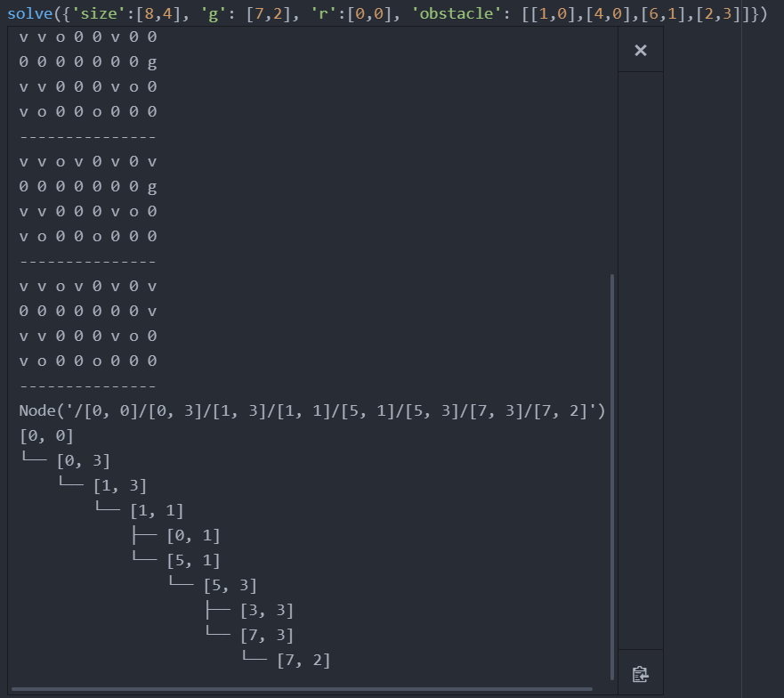

# Task Planning Report

> Rui Xiao rx12@rice.edu  Chuyu Duan cd58@rice.edu

### Problem Statement and Motivation
For this project we are doing 5.6 Task Planning, that is to design an SAT planner to solve the "Sokoban on Ice" problem. By solving this problem we will understand how to solve robotics problems using task planning, to model the problem into a task planning problem, and finding the optimal methods to solves these problems. Since task planning problems play a important role in industry world, and efficient task planning methods are the key to saving resources as well as increasing efficiency. Moreover, Planning as Satisfiability is a classic but still challenging problem that continue to inspire the field of computer science. We are motivated to explore the methods and reasons behind this broadly applied field of study. 
### Explanation of Approach
Planning for the version without movable obstacles is easy. There are no vary situations that need to be considered as when to move the movable obstacles and at which direction to move the movable obstacles. It is not difficult to generate a formula constructed with a set of actions, goal, and horizon length such that the formula is satisfiable if and only if there is a plan with the given horizon. However, designing a planner for the version with movable obstacles is much more challenging.  
#### How

#### Why

#### Optimization

reduce number of variables

#### BFS
Both python and c++ version of the BFS algorithm are implemented.
For the unmovable python algorithm, the average runtime is around 0.036s (50 rounds). For the movable python algorithm, the average runtime is around 0.057s (50 rounds). While the BFS algorithm generally runs faster than our SAT algorithm, and that the unmovable python algorithm provides 100% correct solution, it should be noted that the movable python algorithm works fine with scene 1 but fails to find the solution for scene 2. That is because an optimal algorithm will decide to not push the movable obstacle on [1,4] while the BFS algorithm doesn't hesitate to do so. A better algorithm is needed to fix this problem.
As shown in the graph, the python algorithm takes input that is modified from the given scene, and outputs the BFS movement each step, the solution, and the tree. In the screenshots, 'v' stands for visited nodes, 'o' for obstacles, 'm' for movables, and 'g' for goal.

### Description of Experiments

#### Robot

In the experiment we designed, the robot is tasked with reaching a target cell in the grid world. It can move in any of the four cardinal directions (up, down, left, right). When it starts moving, it can not stop until it hits a static obstacle or the workspace boundary.

#### Environment

The environment is a fixed size rectangular bound that contains fixed size triangles. Each triangle represents either the robot, the goal, an empty space, an static obstacle, or a movable ice. One way to solidate the problem is to model the boundary into static obstacles as well.

#### Potential Solution

假定XX步内有可行解

#### Runtime Platform

运行环境

### Analysis

#### Example

#### Benchmark

Time, Memory(State Number, State Size), Failure, Stability(time)

#### Optimality

#### Completeness

#### Comparison with BFS

### Difficulties of Exercises
